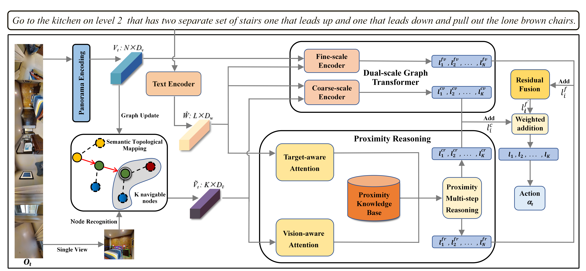

# Hierarchical Spatial Proximity Reasoning for Vision-and-Language Navigation

Most Vision-and-Language Navigation (VLN) algorithms are prone to making decision due to a lack of visual common sense and insufficient reasoning capabilities. To address this issue, we propose a Hierarchical Spatial Proximity Reasoning (HSPR) method. First, we introduce a scene understanding auxiliary task to help the agent build a knowledge base of hierarchical spatial proximity. This task utilizes panoramic views and object features to identify types of nodes and uncover the adjacency relationships between nodes, objects, and between nodes and objects. Second, we propose a multi-step reasoning navigation algorithm based on hierarchical spatial proximity knowledge base, which continuously plans feasible paths to enhance exploration efficiency. Third, we introduce a residual fusion method to improve navigation decision accuracy. Finally, we validate our approach with experiments on publicly available datasets including REVERIE, SOON, R2R, and R4R.



## Requirements

1. Install Matterport3D simulators: follow instructions [here](https://github.com/peteanderson80/Matterport3DSimulator).
   We use the latest version instead of v0.1.

```
export PYTHONPATH=Matterport3DSimulator/build:$PYTHONPATH
```

2. Install python>=3.8, pytorch==1.7.1:

```setup
conda create --name hspr python=3.8.5
conda activate hspr
# conda
conda install pytorch==1.7.1 torchvision==0.8.2 torchaudio==0.7.2 cudatoolkit=11.0 -c pytorch
# pip
pip install torch==1.7.1+cu110 torchvision==0.8.2+cu110 torchaudio==0.7.2 -f https://download.pytorch.org/whl/torch_stable.html
```

3. Install requirements:

```setup
pip install -r requirements.txt
```

4. Download data from [Dropbox](https://www.dropbox.com/sh/u3lhng7t2gq36td/AABAIdFnJxhhCg2ItpAhMtUBa?dl=0), including
   processed annotations, features and pretrained models of REVERIE, SOON, R2R and R4R datasets, download labels about
   the navigation environment from [Baidu Netdisk](https://pan.baidu.com/s/1MbS43QQkqtDBPWZ-hr5Uqg?pwd=23r7), and put it
   all into the 'datasets' directory.

5. Download pretrained lxmert

```
mkdir -p datasets/pretrained 
wget https://nlp.cs.unc.edu/data/model_LXRT.pth -P datasets/pretrained
```

## Pretraining

Combine behavior cloning and auxiliary proxy tasks in pretraining:

```pretrain
cd pretrain_auxiliary_src
bash run_reverie.sh # (run_soon.sh, run_r2r.sh, run_r4r.sh)
```

## Fine-tuning & Evaluation

Use pseudo interative demonstrator to fine-tune the model:

```finetune
cd reasoning_nav_src
bash scripts/run_reverie.sh # (run_soon.sh, run_r2r.sh)
```
